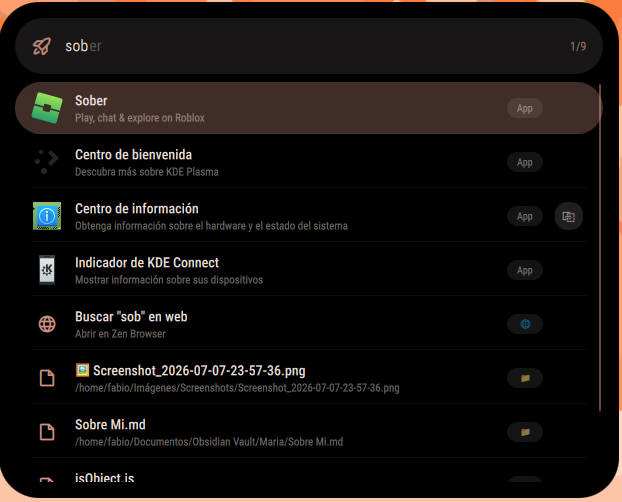
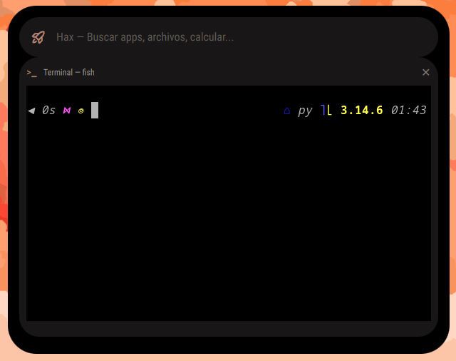

# Hax 🎯 **v4.0 LTS**

**Hax** es un spotlight/launcher modular para shells Wayland basadas en **Ambxst**, construido con Quickshell y Qt QML. Inspirado en Spotlight de macOS, ofrece búsqueda instantánea de aplicaciones, archivos, cálculos inline, acciones rápidas del sistema, terminal integrada, timers, alarmas, instalación de paquetes, clima y mucho más — todo desde una interfaz limpia, rápida y nativa.

> 🏆 **v4.0 LTS — Versión estable de largo plazo.** A partir de ahora solo habrá correcciones de bugs y ajustes estéticos. Hax está completo y listo para el día a día.
>
> 📊 `SpotlightView.qml` pesa **~5050 líneas** de QML/JS puro.

> ⚠️ Hax se instala **sobre Ambxst**. Este repo contiene solo los archivos de Hax y nuestras modificaciones. Ambxst se instala primero (automáticamente con `hax-install.sh`) y luego Hax se inyecta encima.

---

## 📸 Galería

<p align="center">
  
</p>

<p align="center">
   
  <br>
  <em>Búsqueda de apps, paquetes, comandos y más</em>
</p>

<p align="center">
 
  <br>
  <em>Terminal embebida: escribe / y abre una terminal real (PTY) dentro de Hax</em>
</p>

<p align="center">
 <video src="https://github.com/user-attachments/assets/9b14eecc-a359-438f-9041-73d1e3866318" width="100%" controls></video>
  <br>
  <em>Video: Demostracion de la nueva animacion que tiene el buscador inspirada en el Spotlight del <strong>ipadOS 27</strong></em>
</p>

<p align="center">
 <video src="https://github.com/user-attachments/assets/2ec3f49d-d599-4b62-a8e6-8ff708fbc6db" width="100%" controls></video>
  <br>
  <em>Video: Demostracion del poder que tiene <strong>Hax</strong> y showcase de funciones implementadas recientemente</em>
</p>
---

## ✨ Características

| Característica | Descripción |
|----------------|-------------|
| 🔍 **Búsqueda de apps** | Encuentra apps instaladas con resultados ordenados por uso |
| 📊 **Monitor del sistema** | `stats` — muestra CPU, RAM, disco y temperatura en vivo con barras de progreso |
| 📦 **Buscador de paquetes** | `install firefox` — busca en pacman + AUR (yay) + flatpak a la vez |
| ⏱️ **Timers** | `timer 5m`, `timer pizza 10m`, `timer 30s` — con notificación al terminar |
| 🔔 **Alarmas** | `alarm 8:00`, `alarm 7:30 l-v`, `alarm 14:30 comida` |
| 🌤️ **Clima** | `weather`, `weather Madrid` — pronóstico actual |
| 🧮 **Calculadora inline** | Escribe `23*4` → muestra `= 92` al instante |
| ⚡ **Acciones rápidas** | `lock`, `apagar`, `reiniciar`, `suspender`, `capturar` |
| 💻 **Terminal embellecida** | Escribe `/` para abrir una **terminal real (PTY)** dentro de Hax (tu shell por defecto, p. ej. fish) — cierra con `exit` o `Esc` |
| 🔒 **Lockscreen** | Bloqueo de pantalla integrado |
| 📸 **Screenshot** | Captura de pantalla con un comando |
| 🔄 **Actualizar sistema** | `update` — pacman -Syu |
| 🗑️ **Desinstalar** | `remove paquete` |
| 🌐 **Búsqueda web** | Cualquier texto que no sea comando se busca en Google |
| 📖 **Ayuda integrada** | Escribe `ayuda`, `help` o `?` para ver todos los comandos |
| 🪟 **Hax View (Workspace Grid)** | Escribe `show` para abrir una **cuadrícula visual** de todos tus espacios de trabajo con las ventanas en miniatura en vivo. Navega con **↑↓←→** y pulsa **Enter** para ir a la ventana seleccionada. Compatible con Hyprland (usa hyprctl para cambiar de workspace/enfocar). |
| 🐞 **Modo desarrollador (debug)** | Escribe `d`, `dev` o `debug` → la opción **🐞 Modo desarrollador (debug)** aparece la **primera** en la lista. Pulsa **Enter** (o clic) para abrir un panel **persistente abajo**, con errores capturados, tiempos de carga (apertura + última búsqueda + sesión) y consumo de recursos del propio Hax (memoria/CPU). Ciérralo con el botón **✕** o **Esc** |
| 📋 **Historial inteligente** | con **Enter** copia el resultado, y para abrir el historial solo pon en el buscador `history` |
| 🎯 **Autocompletado inline** | Mientras escribes, Hax sugiere en gris el resultado que coincide; acepta con **Tab** / **→** |
| ⚙️ **Panel de configuración** | Escribe `config` para abrir el panel de configuración de Hax: activar OCR, cambiar color, gestionar acciones rápidas personalizadas y más |
| 📖 **Glosario / Diccionario** | Escribe `g`, `glo` o `glosario` y pulsa **Enter**: Hax entra en modo diccionario y se queda esperando la palabra. Al escribirla, la **definición aparece en vivo abajo** (es→en, vía Wiktionary). **Enter** copia la definición, **Esc** sale del modo |

---

## 📦 Requisitos

- Una **shell basada en Ambxst** (Ambxst original, Ax-shell, o cualquier fork)
- [Quickshell](https://git.outfoxxed.me/outfoxxed/quickshell) — Motor QML para Wayland
- Qt6 (base, declarative, wayland, svg)
- **Hyprland** u otro compositor Wayland compatible
- Herramientas: `grim`, `slurp`, `jq`, `playerctl`, `wl-clipboard`, `brightnessctl`
- **Para la terminal embebida:** el instalador compila e instala [`qmltermwidget`](https://github.com/Swordfish90/qmltermwidget) (plugin QML para Qt6) automáticamente. En instalación manual, instálalo tú mismo.
- **Fuente de iconos Phosphor:** Hax usa la fuente *Phosphor* (`Phosphor-Bold`, etc.) para sus iconos. El instalador la copia automáticamente desde `assets/fonts/` a `~/.local/share/fonts/Hax` y ejecuta `fc-cache`. En instalación manual, instala el paquete `phosphor-icons` (o copia los `.ttf` a tu directorio de fuentes).
- **Para Live Text (OCR):** el instalador instala **Tesseract** + los datos de idioma **inglés y español** (`tesseract-data-eng`, `tesseract-data-spa` en Arch; equivalentes en Debian/Fedora). Sin esto, la búsqueda dentro de imágenes no funciona. Puedes ampliar los idiomas con la variable `HAX_OCR_LANGS` (p. ej. `eng+spa+fra`).

---

## 🚀 Instalación

### 🔹 Ambxst original (automático — recomendado)

```bash
curl -sSL https://raw.githubusercontent.com/fabiolopezperez-hue/ambxst-Hax/main/hax-install.sh | bash
```

> El instalador funciona incluso desde `curl | bash`: detecta que se ejecuta desde un pipe, clona el repo temporalmente y hace la instalación completa. Cuando termina, se limpia solo.

O localmente (te permite elegir rama):

```bash
git clone https://github.com/fabiolopezperez-hue/ambxst-Hax.git
cd ambxst-Hax
chmod +x hax-install.sh
./hax-install.sh
```

**¿Qué hace?**
1. Si no tienes Ambxst instalado, lo instala (binario + fuente desde `Axenide/Ambxst`)
2. Copia Hax (spotlight, config con persistencia de acciones rápidas, defaults, assets)
3. **Sobrescribe `Config.qml`** con nuestra versión optimizada para Hax (con backup automático)
4. Configura el atajo `Super + /` en Hyprland (soporta `.lua` y `.conf`)

### 🔹 Fork / shell personalizada

```bash
./hax-install.sh -t ~/Repos/mi-shell
```

O con variable de entorno:

```bash
AMBXST_SRC=~/Repos/mi-shell ./hax-install.sh
```

**¿Qué hace?**
- Copia Hax (spotlight, config con persistencia, defaults, assets)
- **Sobrescribe `Config.qml`** con nuestra versión (con backup automático)
- **No instala Ambxst** (asume que ya tienes tu propia shell)
- **No necesita** que tu shell sea Ambxst — funciona en cualquier shell con estructura de módulos de Quickshell

### 🔹 Manual

```bash
# Copia Hax (estos archivos están en el repo)
cp -r modules/widgets/spotlight   /ruta/a/tu-shell/modules/widgets/
cp    config/Config.qml           /ruta/a/tu-shell/config/
cp    config/defaults/hax.js      /ruta/a/tu-shell/config/defaults/
cp    assets/presets/Ambxst\ Default/hax.json /ruta/a/tu-shell/assets/presets/Ambxst\ Default/

# Y añade a tu config de Hyprland:

**Formato hyprlang (`.conf`):**
```conf
bind = SUPER, slash, exec, qs -p "/ruta/a/tu-shell/modules/widgets/spotlight/SpotlightView.qml"
```

**Formato Lua (`hyprland.lua`, Hyprland 0.55+):**
```lua
hl.bind("SUPER + Slash", hl.dsp.exec_cmd('qs -p "/ruta/a/tu-shell/modules/widgets/spotlight/SpotlightView.qml"'))
```

> El instalador detecta automáticamente si usas `hyprland.lua` o `hyprland.conf` y configura el atajo en el formato correcto.


---

## ⌨️ Uso

### Comandos principales

 Escribe | Qué hace |
|---------|----------|
| firefox (o cualquier app) | Busca y abre la aplicación |
| install firefox | Busca el paquete en pacman + AUR + flatpak |
| timer 5m | Crea un timer de 5 minutos |
| timer pizza 10m | Timer con nombre "pizza", 10 minutos |
| alarm 8:00 | Alarma a las 8:00 |
| alarm 7:30 l-v | Alarma a las 7:30 de lunes a viernes |
| weather | Clima actual |
| weather Madrid | Clima de Madrid |
| lock / bloquear | Bloquear pantalla |
| apagar / shutdown | Apagar sistema |
| reiniciar / reboot | Reiniciar |
| suspender / suspend | Suspender |
| capturar / screenshot | Capturar pantalla |
| update | Actualizar sistema (pacman -Syu) |
| remove firefox | Desinstalar paquete |
| stats / monitor | Monitor del sistema con CPU, RAM, disco y temperatura en vivo |
| config | Abre el **panel de configuración de Hax**: OCR, color, acciones rápidas personalizadas |
| d / dev / debug | Abre el **Modo desarrollador (debug)** — panel con errores, tiempos y recursos de Hax (abajo, donde el monitor) |
| show | Abre el **Hax View**: cuadrícula visual con todos los workspaces y sus ventanas en miniatura en vivo. Navega con **↑↓←→**, pulsa **Enter** para ir a la ventana, **Esc** para cerrar |
| ayuda / help / ? | Muestra la ayuda completa |
| reindexar / ocr | **Live Text:** reindexa todas tus imágenes (vuelve a leer el texto con OCR) |
| / | Abre la **terminal embebida** (PTY real) dentro de Hax |
| 23*4 | Calcula y muestra el resultado inline 

 Atajos de teclado

| Tecla | Acción |
|-------|--------|
| Super + / | Abrir Hax |
| ↑ / ↓ | Navegar resultados / scroll en terminal |
| Tab / → | Aceptar sugerencia de autocompletado |
| ↑↓←→ | Navegar ventanas en el **Hax View** (cuando está abierto con `show`) |
| Enter | Ir a la ventana seleccionada en el **Hax View** |
| Esc | Cerrar / cerrar monitor / cerrar modo debug / cerrar Hax View |
| historial / clip | Muestra el historial de copias |


```
## 🧱 Estructura del repo


ambxst-Hax/
├── hax-install.sh                        # Instalador automático
├── version                               # v4.0
├── README.md                             # Este archivo
├── .gitignore
├── config/
│   ├── Config.qml                        # Config central (con persistencia de Hax)
│   └── defaults/
│       └── hax.js                        # Defaults de Hax
├── assets/
│   └── presets/
│       └── Ambxst Default/
│           └── hax.json                  # Preset de configuración de Hax
 ├── modules/
 │   └── widgets/spotlight/
 │       ├── qmldir                        # Registro del módulo
 │       ├── SpotlightView.qml             # 🧠 Todo Hax (~5050 líneas)
 │       ├── PluginManager.qml             # 🔌 Gestor de plugins (scan, hot-reload, persistencia, errores)
 │       ├── HaxPlugin.qml                 # 🧩 Base para plugins QML (N3)
 │       └── plugin-ejemplo.sh             # 📦 Plugin de ejemplo (N2 script) que se copia al usuario
 └── screenshots/
    ├── hax-search-bar.png
    ├── new-animation-Hax.mp4
    ├── new-functions-Hax.mp4
    ├── resultados-Hax.png
    └── terminal-Hax.png`
```

**Nota:** A diferencia de otros launchers, Hax es **monolítico** por diseño — todo el código vive en un solo archivo `SpotlightView.qml` (~5050 líneas). Esto evita la fragmentación y hace que sea fácil de mantener y modificar.

> Este repo contiene **solo los archivos de Hax** que modificamos. El resto de dependencias (servicios, theme, componentes, scripts) las provee Ambxst, que se instala primero. Si tu shell ya los tiene, el instalador no los duplica.

---

## 🔧 ¿Usas una shell personalizada (fork, custom, etc)?

¡Funciona igual! Solo usa el flag `-t`:

```bash
./hax-install.sh -t /ruta/a/tu-shell
```

**No necesitas tener Ambxst.** Hax se instala en cualquier shell basada en Quickshell que tenga la estructura de módulos (`modules/widgets/`, `modules/services/`, etc.).

El instalador:
- Copia Hax (spotlight, config con persistencia, defaults, assets) en tu shell
- **Sobrescribe `Config.qml`** con nuestra versión (con backup automático)
- **No instala Ambxst** — respeta tu shell actual
 - Configura el atajo `Super + /` en Hyprland si no existe

---

## 🔌 Sistema de Plugins

Hax tiene un sistema de plugins de doble capa que se integra **dentro** del propio Hax (no como notificaciones del sistema), con hot-reload automático y aislamiento de errores.

### 📁 Dónde viven los plugins

```
~/.config/hax/plugins/
```

El instalador crea esta carpeta y copia el plugin de ejemplo (`ejemplo.sh`). Puedes añadir los tuyos ahí en cualquier momento.

### 🟢 N2 — Plugins tipo script (`.sh` / `.py`)

Son ejecutables que Hax detecta automáticamente. Cada script debe imprimir al stdout un JSON con sus resultados. Ejemplo mínimo (`plugin-ejemplo.sh`):

```bash
#!/bin/bash
# Plugin de ejemplo para Hax (N2)
# Imprime un JSON array con los resultados que Hax mostrará en la lista.
query="$1"

# Resultado estático de ejemplo
echo '[
  {
    "title": "Hola desde mi plugin 💖",
    "subtitle": "Este es un resultado de ejemplo",
    "icon": "🧩",
    "actions": [
      { "name": "Saludar", "command": "echo \"Hola, mi amor desde Hax\"" }
    ]
  }
]'
```

- Hax hace un **precache del catálogo** una vez al arrancar y filtra en memoria en cada búsqueda (rápido).
- Las acciones (`command`) se ejecutan capturando su salida, que se muestra como **notificación inline dentro de Hax** (se autocierra a los 5s).
- Si un plugin falla, se aísla con `try/catch` y no rompe el resto.

### 🟣 N3 — Plugins QML (`.qml`)

Herenan de `HaxPlugin.qml` y siguen un ciclo de vida: `onLoad`, `onSearch(query)` y `onExecute(result)`. Permiten UI rica y acceso a todo el ecosistema de Quickshell.

### ⚡ Características del sistema

| Característica | Estado |
|----------------|:---:|
| Detección automática de scripts y QML | ✅ |
| Hot-reload (escanea cambios cada 5s) | ✅ |
| Persistencia activar/desactivar (`plugin-state.json`) | ✅ |
| Aislamiento de errores por plugin | ✅ |
| Resultados y acciones **dentro de Hax** (sin `notify-send`) | ✅ |
| HaxAPI (`showResult`, `getConfig`, `setConfig`, `copyToClipboard`, `runCommand`, `openUrl`, `openFile`…) | ✅ |

> 💡 Crea el tuyo: copia `plugin-ejemplo.sh` a `~/.config/hax/plugins/`, cámbiale el nombre y edítalo. Hax lo recogerá solo en ≤5s.

---

## 🏆 ¿Por qué Hax es la mejor opción?

Hax no compite solo como "un launcher más". Es un **centro de productividad completo** que vive dentro de tu shell (Ambxst), y en 2026 sigue siendo la opción más completa para quienes usan una shell Wayland personalizada (Hyprland + Ambxst).

### Comparativa con los launchers más populares de Linux

| Característica | 🎯 **Hax** | Rofi | Ulauncher | Albert | Vicinae |
|----------------|:---:|:---:|:---:|:---:|:---:|
| Búsqueda de apps | ✅ | ✅ | ✅ | ✅ | ✅ |
| Calculadora inline | ✅ nativa | ⚠️ plugin | ⚠️ ext | ✅ | ✅ |
| **Terminal embebida (PTY real)** | ✅ `/` | ❌ | ❌ | ❌ | ❌ |
| **Plugins (script + QML)** | ✅ N2 + N3 | ⚠️ complejo | ✅ Py | ✅ C++/Py | ✅ ext |
| **Notificaciones inline** (sin `notify-send`) | ✅ | ❌ | ❌ | ❌ | ❌ |
| **Monitor del sistema en vivo** | ✅ | ❌ | ❌ | ⚠️ | ❌ |
| **Timers y Alarmas** | ✅ | ❌ | ⚠️ | ⚠️ | ⚠️ |
| **Live Text (OCR en imágenes)** | ✅ (off por defecto) | ❌ | ❌ | ❌ | ❌ |
| **Hax View** (grid visual de workspaces) | ✅ | ⚠️ window switch | ❌ | ❌ | ❌ |
| **Diccionario en vivo** | ✅ | ❌ | ❌ | ❌ | ❌ |
| **Gestión de paquetes** (pacman/AUR/flatpak) | ✅ | ❌ | ❌ | ⚠️ | ❌ |
| Hot-reload de plugins | ✅ | ❌ | ⚠️ | ⚠️ | ✅ |
| Aislamiento de errores por plugin | ✅ | n/a | ⚠️ | ⚠️ | ✅ |
| Estética tipo Spotlight iPadOS | ✅ | ⚠️ | ⚠️ | ⚠️ | ✅ |

### Veredicto por perfil

- 🥇 **Usuario de shell completo (Hyprland + Ambxst): HAX es el mejor.** Ningún launcher tiene terminal embebida real, monitor en vivo, gestión de paquetes, Live Text, Hax View y diccionario integrados. Los otros son *launchers puros*; Hax es un centro de productividad que vive en tu shell.
- 🥈 **Purista de tiling WM que quiere 0 RAM en reposo: Rofi.** No corre en background, arranca rápido y hace de todo con scripts. Pero la UX es tosca y configurar plugins cuesta horas.
- 🥉 **Quien quiere algo que "simplemente funcione" fuera de un shell custom: Ulauncher.** El OOB experience más amigable y buen ecosistema de extensiones, pero sin la profundidad de Hax.
- **Albert** queda descartado por complejidad y memory leaks reportados. **Vicinae** es prometedor (estilo Raycast) pero aún verde.

> 💡 **En resumen:** si ya usas Ambxst, **Hax gana sin discusión**. Si usas un escritorio genérico (GNOME/KDE) sin shell custom, **Ulauncher** es la mejor opción práctica. Y si eres de tiling WM hardcore y prefieres minimalismo, **Rofi**.
>
> El único punto débil de Hax es que **corre dentro de Ambxst** (no es standalone como los otros) — pero eso mismo es su superpoder: aprovecha todo el ecosistema de la shell.

---

## 📋 Changelog

### v4.0 LTS — Julio 2026 — 🏆 Versión estable de largo plazo

Hax alcanza la madurez. **A partir de esta versión, no habrá nuevas funciones.** Solo correcciones de bugs y ajustes estéticos.

#### 🔌 Sistema de Plugins (N2 script + N3 QML)
- **🟢 Plugins script (`.sh`/`.py`)** — Hax detecta ejecutables en `~/.config/hax/plugins/`, hace precache del catálogo y filtra en memoria por búsqueda. Cada script imprime un JSON con `title`, `subtitle`, `icon` y `actions`.
- **🟣 Plugins QML (`.qml`)** — Herenan de `HaxPlugin.qml` con ciclo de vida `onLoad` / `onSearch` / `onExecute`, para UI rica dentro de Hax.
- **⚡ Hot-reload** — `PluginManager.qml` escanea cambios cada 5s y registra/elimina plugins en caliente.
- **💾 Persistencia** — `plugin-state.json` guarda qué plugins están activos; se aplica in-place al cargar.
- **🛡️ Aislamiento de errores** — `try/catch` por plugin en `queryAll`; si uno falla, los demás siguen funcionando.
- **🔔 Resultados y acciones dentro de Hax** — Las acciones ejecutan comandos y su salida se muestra como notificación inline (auto-cierre 5s), sin `notify-send`.
- **🧰 HaxAPI ampliado** — `copyToClipboard`, `runCommand`, `showNotification`, `openUrl`, `openFile`, `readClipboard`, `getPluginDir`, `showResult`, `getConfig`/`setConfig`.
- **📦 Instalador** — `hax-install.sh` crea `~/.config/hax/plugins/` y copia el plugin de ejemplo (`plugin-ejemplo.sh` → `ejemplo.sh`).

#### 🪟 Hax View — Cuadrícula visual de workspaces
- **🖥️ Vista en vivo de todos los workspaces** — Escribe `show` para abrir una cuadrícula 16:9 con miniaturas en vivo (ScreencopyView) de todas las ventanas abiertas, agrupadas por espacio de trabajo.
- **⌨️ Navegación total con teclado** — **↑↓** navegan entre ventanas, **←→** saltan entre workspaces, **Enter** cambia al workspace y enfoca la ventana seleccionada, **Esc** cierra la vista.
- **📐 Grid adaptativo** — Cada workspace se muestra como una tarjeta 16:9. Las ventanas se distribuyen en un grid que las rellena sin desbordar: 1 ventana → ocupa todo, 2 → lado a lado, 3-4 → 2×2, 5-6 → 3×2. Más de 6 → indicador "+X".
- **🔄 Actualización automática** — Un timer interno refresca el grid cada 2 segundos para reflejar cambios de ventanas en tiempo real.

#### 🎯 Acciones rápidas personalizadas (persistencia real)
- **⚡ `customShortcuts`** — Añade, edita y elimina acciones rápidas desde el panel de configuración de Hax. Ahora **persisten** de verdad tras reiniciar Quickshell o el sistema.
- **🛠️ Arreglada la persistencia** — El problema era que `list<var>` no se serializaba correctamente con el JsonAdapter de Quickshell. Se cambió a `string` con JSON.stringify/parse.
- **⏱️ Timer personalizado** — Nueva entrada "Timer personalizado" en el selector de acciones predefinidas. Al seleccionarlo, escribe `timer ` y enfoca el campo para que pongas la duración.

#### 🔧 Correcciones
- **🐛 Scroll secuestrado** — Al ejecutar `update`, las flechas ↑/↓ quedaban capturadas por la terminal aunque no hubiera scroll. Ahora solo capturan cuando la terminal tiene contenido desbordado (`contentHeight > height`).
- **🐛 Instalador mejorado** — `Config.qml` ahora **siempre se sobrescribe** (con backup automático). Antes se saltaba si existía, dejando a Hax sin persistencia de acciones rápidas.
- **🧹 Repositorio limpiado** — Eliminados todos los archivos de Ambxst que no tocamos. El repo pesa un 95% menos y solo contiene lo que Hax necesita.

#### 📦 Notas de versión
- Esta es la **última versión con cambios funcionales**.
- De ahora en adelante: solo **bug fixes** y **retoques visuales**.
- Si encuentras un bug, abre un issue en GitHub. Si quieres una función nueva, haz un fork.

### v3.1.0 — Julio 2026 — ⚡ Optimización masiva del motor interno
Esta es la **segunda versión estable** de Hax

#### 🔧 Optimizaciones de rendimiento
- **🌤️ Clima nativo (sin curl)** — El clima ahora usa **XMLHttpRequest** directamente a `wttr.in` en vez de lanzar `curl` cada vez. Cero procesos por consulta.
- **📋 Clipboard watcher persistente** — Antes: un **Timer que spawnaba 40 procesos por minuto** (`wl-paste` cada 1.5s). Ahora: un **solo proceso persistente** con `while+sleep` que escucha cambios sin spawn innecesarios.
- **💾 Historial sin Python** — `_writeHistory` antes ejecutaba `python3 -c` cada vez que copiabas algo. Ahora escribe el JSON directamente con `printf '%s'` en bash puro. Adiós a la dependencia de Python en Hax.
- **🐞 Debug sin timer** — El monitor de recursos del debug antes creaba **1 proceso por segundo** (`/proc` reads). Ahora es un solo proceso persistente que actualiza CPU/memoria sin spawn.
- **🔄 Autocopletado limitado** — El bucle que busca resultados ya no recorre arrays enormes: se corta automáticamente a los primeros **20 resultados**.

#### 🧱 Refactorización
- **✕ CloseButton como componente reutilizable** — Extraído a `modules/components/CloseButton.qml`. Los 6 botones de cierre (terminal, cmd, diccionario, monitor, debug, previsualización) usan el mismo componente, con hover opacity consistente.
- **🔁 Behaviors unificados** — Diccionario, monitor y previsualización ahora usan `Config.animDuration` para sus animaciones de altura/opacidad, igual que el resto de paneles.

### v3.0.1 — Julio 2026 — 📖 Glosario / Diccionario

- **📖 Glosario / Diccionario** — Escribe `g`, `glo` o `glosario` y pulsa **Enter**: Hax entra en modo diccionario y **se queda esperando la palabra**. Al escribirla, la **definición aparece en vivo abajo** del buscador (busca en español y hace fallback a inglés vía `dictionaryapi.dev`, sin API key). **Enter** copia la definición al portapapeles; **Esc** sale del modo. Cubre el hueco que dejaba Spotlight de macOS (que no trae diccionario integrado en el launcher).
  - Nuevo script `scripts/dict.sh` (es→en vía Wiktionary, con fallback automático).

### v3.0 — Julio 2026 — 🎉 VERSIÓN ESTABLE

Esta es la **primera versión estable** de Hax. Reúne todas las funciones grandes añadidas durante el ciclo 2.x, las deja pulidas, documentadas y con instalación de un solo comando.

**Lo que se ha añadido (resumen del ciclo 2.x → 3.0):**
- **🖥️ Terminal embebida (PTY real)** — Escribe `/` y abre una terminal completa e interactiva dentro de Hax (tu shell por defecto, p. ej. fish), con `vim`, `htop`, `sudo`, TAB… Cierra con `exit` o `Esc`.
- **🐞 Modo desarrollador (debug)** — Escribe `d` / `dev` / `debug` para ver errores capturados, tiempos de carga y consumo de recursos de Hax, en un panel persistente abajo.
- **🖼️ Live Text (OCR)** — Busca **palabras escritas dentro de tus imágenes** (tipo macOS): indexado en background con Tesseract, resultados 🖼️ con snippet, texto detectable en la Vista rápida (copiable) y `reindexar` para re-escanear. Escribe `live` / `estado` / `ocr` para ver el estado.
- **👁 Vista rápida (Quick Look)** — Previsualiza archivos dentro de Hax (imagen o texto) al navegar con ↑/↓; el texto OCR aparece debajo de las imágenes.
- **📜 Historial inteligente** — Hax guarda todo lo que copias y lo sugiere en cualquier búsqueda; borrado individual al hover.
- **📊 Monitor del sistema** — `stats` / `monitor` con CPU, RAM, disco y temperatura en vivo.
- **🔧 Instalador 100% automático** — `hax-install.sh` instala Quickshell (si falta), compila **qmltermwidget**, instala **Tesseract + datos de idioma (eng/spa)**, copia la **fuente Phosphor** y todo Hax. Un solo `curl | bash` lo deja listo.
- **🧩 Autocontenido y portable** — Repo con todas las dependencias; funciona tanto solo (`qs -p …/SpotlightView.qml`) como inyectado en forks/shells personalizadas (`-t`).

> ✅ **Estado: LTS — ESTABLE.** Todo lo anterior está probado de punta a punta y documentado. No se esperan cambios disruptivos.
>
> 📌 **Política de versiones (a partir de 4.0 LTS):**
> - Hax ha alcanzado su madurez. **No habrá nuevas funciones.**
> - Solo **correcciones de bugs** y **ajustes estéticos**.
> - Versiones: `4.0.1`, `4.0.2`, etc. para bugs; `4.1` si hay cambios estéticos acumulados.
> - Si quieres una función nueva, **haz un fork** — ¡Hax es libre y abierto!


### v2.7 — Julio 2026

- **🖼️ Live Text (OCR)** — Busca **texto escrito DENTRO de imágenes**, tipo "Texto en Vivo" de macOS. Al escribir `factura`, Hax encuentra la captura que la contiene aunque el archivo se llame `Screenshot_0142.png`.
  - **Indexado en background** al iniciar Hax: escanea `Documentos`, `Descargas`, `Escritorio`, tu carpeta de `Imágenes`/`Pictures` y `Screenshots`, y lee el texto con **Tesseract** (sin bloquear la UI, con caché por archivo para no re-OCRizar).
  - **Búsqueda:** los resultados por OCR aparecen como 🖼️ con un snippet del texto encontrado.
  - **Vista rápida:** al previsualizar una imagen, Hax muestra el **texto detectado debajo** (copiable con el botón 📋 Copiar).
  - **Reindexar:** escribe `reindexar` (o `ocr`) para volver a leer todas tus imágenes.
  - El instalador añade **Tesseract + datos de idioma (eng/spa)**; ampliable con `HAX_OCR_LANGS`.

### v2.6 — Julio 2026

- **🐞 Modo desarrollador (debug)** — Escribe `d`, `dev` o `debug` y la opción **🐞 Modo desarrollador (debug)** aparece la **primera** en la lista de resultados. Pulsa **Enter** (o clic) para entrar: se abre un panel **persistente abajo, en la misma ubicación que el Monitor del sistema** (no abre el monitor del sistema). Mientras está activo puedes seguir usando el buscador (los resultados se quedan arriba) y ver en vivo:
  - **❌ Errores capturados** de `executeItem`, `openPreview`, `copyResult`, `runCmd` y la terminal embebida.
  - **⏱️ Tiempos**: apertura (open→listo), última búsqueda y sesión abierta.
  - **⚙️ Recursos** del propio Hax: memoria RSS y CPU leídos de `/proc/$PPID` (Quickshell es el padre del proceso).
  - Se cierra con el botón **✕** del panel o con **Esc** (si no hay texto escrito).
- **🪟 Tamaño de ventana corregido en modo debug** — `fullHeight` ahora suma resultados **+** panel de debug, así el panel de debug (abajo) nunca queda recortado fuera de pantalla.
- **🐛 Lectura de recursos del debug corregida** — Se eliminó una señal inexistente (`onError`) que dejaba memoria/CPU en blanco; ahora se actualizan correctamente.

### v2.5 — Julio 2026

- **🖥️ Terminal embebida (PTY real)** — Escribe `/` en el buscador para abrir una **terminal real** dentro de Hax (emulador PTY con `qmltermwidget`, usando tu shell por defecto como fish). Cierra con `exit` o `Esc`. Ya no es un `runCmd` que solo mostraba salida: ahora es interactiva y completa.
- **⌨️ Hax 100% teclado** — La vista rápida (Quick Look) se activa al **navegar con ↑/↓** por los resultados, sin tocar el ratón (el ratón solo se usa para borrar copias en el Historial).
- **🐟 Alias del shell en comandos** — `runCmd` ahora ejecuta con `$SHELL -i -c`, así que respeta tus alias (p. ej. `ls` → `eza` en fish).
- **🔧 Instalador: qmltermwidget automático** — `hax-install.sh` compila e instala el plugin `qmltermwidget` (Qt6) de forma idempotente, para que la terminal embebida funcione en un clone limpio sin pasos manuales.

### v2.4 — Julio 2026

- **👁 Vista rápida (Quick Look)** — Pasa el ratón o pulsa **Enter** sobre un archivo para previsualizarlo **dentro de Hax** (sin abrir nada externo). Imágenes renderizadas en el panel (centradas y con su proporción), texto leído al instante con `cat` y binarios marcados como no previsualizables. El panel se abre integrado en el buscador, en la misma posición que el Monitor del sistema, y se cierra con ✕ o **Esc**.
- **🐛 Posición de la previsualización corregida** — El panel de Quick Look se renderizaba en la esquina superior izquierda de la ventana porque estaba fuera del flujo de layout (`contentColumn`). Ahora vive dentro de `contentColumn`, igual que el Monitor, así que aparece siempre en su sitio.
- **🖼️ Imágenes sin escapes** — Se usa `layer.enabled` en el `Image` para evitar el bug de Quickshell que dibujaba las texturas `file://` en `(0,0)` de la ventana.

### v2.3 — Julio 2026

- **🧠 Historial inteligente** — Hax vigila el portapapeles y guarda TODO lo que copias (de webs, archivos, apps...) en `~/.local/share/hax/history.json`. Escribe `historial`, `clip` o `portapapeles` para verlo. Cada item tiene un botón **✕** al hover para borrarlo. Los items más usados salen primero (aprende de tu uso).
- **📋 Copiar al portapapeles** — **Enter** copia el resultado seleccionado, **Shift+Enter** lo ejecuta/abre. También Ctrl+C o el botón **⎘** al hover. Apps → nombre, archivos → ruta (imágenes → la imagen), calculadora → resultado.
- **🎯 Autocompletado inline** — Mientras escribes, Hax te sugiere en gris el nombre del resultado que coincide con lo que escribes. Acepta con **Tab** o **→**. Escanea **todos los resultados** (apps, archivos, webs...), no solo el primero. Así `virt` → sugiere `ualBox` aunque VirtualBox no sea el primer resultado.
- **🐛 RAM stats corregido** — Mostraba valores incorrectos; ahora divide entre 1048576 (bytes → MB) en vez de 1024
- **🌡️ Temperatura corregida** — Ya no se queda pillada en 20°C (sensor `acpitz`). Ahora lee `k10temp`/`coretemp`/`cpu_thermal` desde `/sys/class/hwmon/` para CPUs AMD/Intel
- **📜 Google Lens** — Nuevo script `scripts/google_lens.sh` para subir capturas a Google Lens y buscarlas
- **🌤️ Clima vía Open-Meteo** — Nuevo script `scripts/weather.sh` usando Open-Meteo API (sin API key, gratuita)
- **🔧 Instalador mejorado** — `hax-install.sh` ahora copia también los `scripts/*.sh` al destino
- **💡 Ideas trackeadas** — Archivo `ideas/notas-hax` con ideas anotadas para futuras mejoras (plugins, snippets, historial, debug mode, traducciones, etc.)

### v2.2 — Julio 2026

- **📦 Repositorio auto-contenido** — Añadidos archivos faltantes para que Hax funcione al clonar desde GitHub sin necesidad de tener Ambxst pre-instalado
- **🐛 Instalador arreglado** — `hax-install.sh` ahora clona el Ambxst original (`Axenide/Ambxst`) en vez de clonarse a sí mismo
- **➕ Archivos de soporte** — Añadidos `config/KeybindActions.js`, `config/ConfigValidator.js`, `version`, `modules/tools/*.qml` y `assets/presets/Ambxst Default/*.json` como fallback para shells personalizadas
- **🔧 Compatible con cualquier shell** — Hax se instala en forks y shells custom con `-t`, sin necesidad de Ambxst
- **📜 Soporte para hyprland.lua** — El instalador detecta automáticamente si usas el nuevo formato Lua (Hyprland 0.55+) y configura el atajo `Super + /` en la sintaxis correcta
- **📖 README actualizado** — Instrucciones claras para Ambxst original, shells personalizadas y ambos formatos de Hyprland

### v2.1 — Julio 2026

- **📊 Monitor del sistema** — `stats` / `monitor` abre un panel con CPU, RAM, disco y temperatura en vivo, con barras de progreso coloreadas (verde/amarillo/rojo) que se actualizan cada 2 segundos
- **🔁 Scroll con flechas** — Navegación por resultados y scroll en terminal con ↑↓, scroll en terminal con la rueda del ratón
- **🖥️ Terminal integrada estable** — Animación de altura desactivada durante procesos, altura mínima de 240px, `.slice()` para que QML detecte cambios en el array de salida
- **⬆️⬇️ Scroll en terminal** — Flechas arriba/abajo hacen scroll cuando la terminal está activa

### v2.0 — Julio 2026

- **🎯 Comando `ayuda`** — Escribe `ayuda`, `help` o `?` para ver el manual completo de comandos
- **⏱️ Timers y Alarmas** — `timer 5m`, `alarm 8:00`, notificaciones inline, auto-apertura al completarse
- **📦 Buscador de paquetes** — `install firefox` busca en pacman + AUR + flatpak y deja elegir
- **🧹 Apps sin duplicados** — Deduplicación por ID en resultados de búsqueda
- **🔄 Procesos estables** — Timeouts de 15-20s, SplitParser, sin cuelgues
- **🚫 Sin reinicios espurios** — `_lastSearchQuery` evita reinicios de búsqueda
- **🖥️ Terminal integrada mejorada** — Hax se queda abierto al instalar paquetes
- **📦 Repositorio completo** — Este repo incluye todas las dependencias, no solo el spotlight

### v1.0

- Búsqueda unificada de apps, archivos y cálculos inline
- Acciones rápidas del sistema (bloquear, apagar, reiniciar, suspender, capturar)
- Terminal integrada con `/comando`
- Tema nativo Ambxst
- Resultados ordenados por uso

---

## 📄 Licencia

Distribuido bajo licencia MIT. Partes del código derivadas de [Ambxst](https://github.com/Axenide/Ambxst).

---

> **Hax v4.0 LTS**
> Si usas Hax y te gusta, una estrella ⭐ en GitHub alegra el día.
> ¿Un bug? [Abre un issue](https://github.com/fabiolopezperez-hue/ambxst-Hax/issues).
> ¿Quieres más funciones? **Haz un fork** — el código es tuyo también.
