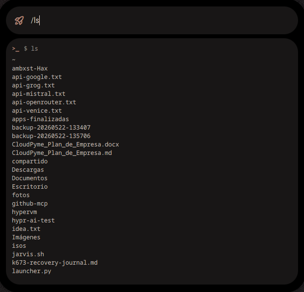
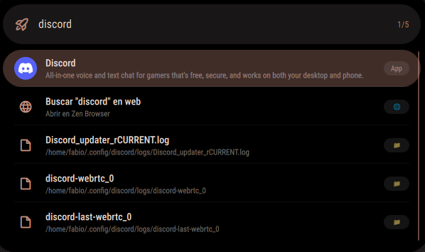

# Hax 🎯

**Hax** es un spotlight/launcher modular para shells Wayland basadas en **Ambxst**, construido con Quickshell y Qt QML. Inspirado en Spotlight de macOS, ofrece búsqueda instantánea de aplicaciones, archivos, cálculos inline, acciones rápidas del sistema, terminal integrada, timers, alarmas, instalación de paquetes, clima y mucho más — todo desde una interfaz limpia, rápida y nativa.

> 💖 Este repo contiene **Hax + todas sus dependencias** (servicios, theme, config, componentes). También funciona en **forks y shells personalizadas** basadas en Ambxst.

---

## 📸 Galería

<p align="center">
  
</p>

<p align="center">
  
  <br>
  <em>Búsqueda de apps, paquetes, comandos y más</em>
</p>

<p align="center">
  
  <br>
  <em>Terminal integrada: ejecuta comandos con / y muestra la salida en vivo</em>
</p>

---

## ✨ Características

| Característica | Descripción |
|----------------|-------------|
| 🔍 **Búsqueda de apps** | Encuentra apps instaladas con resultados ordenados por uso |
| 📦 **Buscador de paquetes** | `install firefox` — busca en pacman + AUR (yay) + flatpak a la vez |
| ⏱️ **Timers** | `timer 5m`, `timer pizza 10m`, `timer 30s` — con notificación al terminar |
| 🔔 **Alarmas** | `alarm 8:00`, `alarm 7:30 l-v`, `alarm 14:30 comida` |
| 🌤️ **Clima** | `weather`, `weather Madrid` — pronóstico actual |
| 🧮 **Calculadora inline** | Escribe `23*4` → muestra `= 92` al instante |
| ⚡ **Acciones rápidas** | `lock`, `apagar`, `reiniciar`, `suspender`, `capturar` |
| 💻 **Terminal integrada** | `/comando` + `Enter` — ejecuta y ve la salida en vivo |
| 🔒 **Lockscreen** | Bloqueo de pantalla integrado |
| 📸 **Screenshot** | Captura de pantalla con un comando |
| 🔄 **Actualizar sistema** | `update` — pacman -Syu |
| 🗑️ **Desinstalar** | `remove paquete` |
| 🌐 **Búsqueda web** | Cualquier texto que no sea comando se busca en Google |
| 📖 **Ayuda integrada** | Escribe `ayuda`, `help` o `?` para ver todos los comandos |

---

## 📦 Requisitos

- Una **shell basada en Ambxst** (Ambxst original, Ax-shell, o cualquier fork)
- [Quickshell](https://git.outfoxxed.me/outfoxxed/quickshell) — Motor QML para Wayland
- Qt6 (base, declarative, wayland, svg)
- **Hyprland** u otro compositor Wayland compatible
- Herramientas: `grim`, `slurp`, `jq`, `playerctl`, `wl-clipboard`, `brightnessctl`

---

## 🚀 Instalación

### 🔹 Ambxst original (automático)

```bash
curl -sSL https://raw.githubusercontent.com/fabiolopezperez-hue/ambxst-Hax/main/hax-install.sh | bash
```

O localmente:

```bash
git clone https://github.com/fabiolopezperez-hue/ambxst-Hax.git
cd ambxst-Hax
chmod +x hax-install.sh
./hax-install.sh
```

### 🔹 Fork / shell personalizada

```bash
./hax-install.sh -t ~/Repos/mi-shell
```

O con variable de entorno:

```bash
AMBXST_SRC=~/Repos/mi-shell ./hax-install.sh
```

El instalador:
- **No instala Ambxst** si no es necesario (forks)
- **No sobrescribe** tu `Config.qml` ni `shell.qml` si ya existen
- **Pregunta interactivamente** si no encuentra la ruta
- Configura el atajo `Super + /` en Hyprland

### 🔹 Manual

Copia los archivos del repo a tu shell:

```bash
cp -r modules/widgets/spotlight   /ruta/a/tu-shell/modules/widgets/
cp    modules/services/*.qml      /ruta/a/tu-shell/modules/services/
cp    modules/globals/*.qml       /ruta/a/tu-shell/modules/globals/
cp    modules/theme/*.qml         /ruta/a/tu-shell/modules/theme/
cp    modules/components/*.qml    /ruta/a/tu-shell/modules/components/
```

Y añade a tu config de Hyprland:

```conf
bind = SUPER, slash, exec, qs -p "/ruta/a/tu-shell/modules/widgets/spotlight/SpotlightView.qml"
```

---

## ⌨️ Uso

### Comandos principales

| Escribe | Qué hace |
|---------|----------|
| `firefox` (o cualquier app) | Busca y abre la aplicación |
| `install firefox` | Busca el paquete en pacman + AUR + flatpak |
| `timer 5m` | Crea un timer de 5 minutos |
| `timer pizza 10m` | Timer con nombre "pizza", 10 minutos |
| `alarm 8:00` | Alarma a las 8:00 |
| `alarm 7:30 l-v` | Alarma a las 7:30 de lunes a viernes |
| `weather` | Clima actual |
| `weather Madrid` | Clima de Madrid |
| `lock` / `bloquear` | Bloquear pantalla |
| `apagar` / `shutdown` | Apagar sistema |
| `reiniciar` / `reboot` | Reiniciar |
| `suspender` / `suspend` | Suspender |
| `capturar` / `screenshot` | Capturar pantalla |
| `update` | Actualizar sistema (pacman -Syu) |
| `remove firefox` | Desinstalar paquete |
| `ayuda` / `help` / `?` | Muestra la ayuda completa |
| `/comando` | Ejecuta un comando en la terminal integrada |
| `23*4` | Calcula y muestra el resultado inline |

### Atajos de teclado

| Tecla | Acción |
|-------|--------|
| `Super + /` | Abrir Hax |
| `↑` / `↓` | Navegar resultados |
| `Enter` | Abrir selección / ejecutar |
| `Esc` | Cerrar |

---

## 🧱 Estructura del repo

```
ambxst-Hax/
├── hax-install.sh                        # Instalador automático
├── shell.qml                             # Entry point (Loader de Hax)
├── config/
│   ├── Config.qml                        # Config central
│   └── defaults/*.js                     # Valores por defecto
├── modules/
│   ├── widgets/spotlight/
│   │   ├── SpotlightView.qml             # 🧠 Todo Hax (~1967 líneas)
│   │   └── qmldir                       # Registro del módulo
│   ├── services/
│   │   ├── Visibilities.qml              # Abrir/cerrar Hax
│   │   ├── GlobalShortcuts.qml           # Atajo de teclado
│   │   ├── LockscreenService.qml         # Bloquear pantalla
│   │   ├── Screenshot.qml                # Capturas
│   │   ├── WeatherService.qml            # Clima
│   │   ├── AppSearch.qml                 # Búsqueda de apps
│   │   ├── AxctlService.qml              # Abstracción del compositor
│   │   └── SuspendManager.qml            # Gestión de suspensión
│   ├── globals/
│   │   └── GlobalStates.qml              # Estado global transitorio
│   ├── theme/
│   │   ├── Colors.qml                    # Paleta de colores
│   │   ├── Icons.qml                     # Iconos Phosphor
│   │   └── Styling.qml                   # Estilos compartidos
│   └── components/
│       └── StyledRect.qml                # Contenedor base con theming
├── screenshots/
│   ├── hax-search-bar.png
│   ├── hax-results.png
│   └── hax-terminal.png
└── README.md
```

**Nota:** A diferencia de otros launchers, Hax es **monolítico** por diseño — todo el código vive en un solo archivo `SpotlightView.qml` (~1967 líneas). Esto evita la fragmentación y hace que sea fácil de mantener y modificar.

---

## 🔧 ¿Usas un fork de Ambxst?

¡Funciona igual! Solo usa el flag `-t`:

```bash
./hax-install.sh -t /ruta/a/tu-shell
```

El instalador:
- Copia Hax y sus dependencias en tu shell
- No toca tu `Config.qml` ni `shell.qml` si ya existen
- No instala Ambxst (porque ya tienes tu propia shell)
- Te pregunta si no encuentra la ruta

---

## 📋 Changelog

### v2.0 — Julio 2026

- **🎯 Comando `ayuda`** — Escribe `ayuda`, `help` o `?` para ver el manual completo de comandos
- **⏱️ Timers y Alarmas** — `timer 5m`, `alarm 8:00`, notificaciones inline, auto-apertura al completarse
- **📦 Buscador de paquetes** — `install firefox` busca en pacman + AUR + flatpak y deja elegir
- **🧹 Apps sin duplicados** — Deduplicación por ID en resultados de búsqueda
- **🔄 Procesos estables** — Timeouts de 15-20s, SplitParser, sin cuelgues
- **🚫 Sin reinicios espurios** — `_lastSearchQuery` evita reinicios de búsqueda
- **🖥️ Terminal integrada mejorada** — Hax se queda abierto al instalar paquetes
- **📦 Repositorio completo** — Este repo incluye todas las dependencias, no solo el spotlight

### v1.0

- Búsqueda unificada de apps, archivos y cálculos inline
- Acciones rápidas del sistema (bloquear, apagar, reiniciar, suspender, capturar)
- Terminal integrada con `/comando`
- Tema nativo Ambxst
- Resultados ordenados por uso

---

## 📄 Licencia

Distribuido bajo licencia MIT. Partes del código derivadas de [Ambxst](https://github.com/Axenide/Ambxst).

---

<p align="center">
  Hecho con 💖 por Fabio y Maria
</p>
